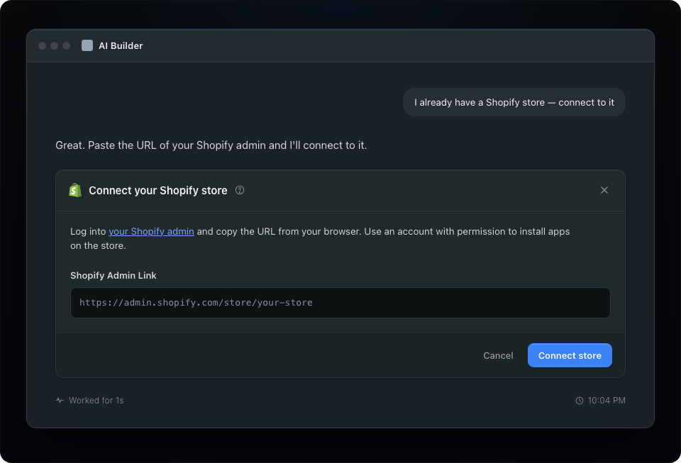

# Connect to an existing store

When merchants already have a Shopify store, they paste the store URL. Tell them exactly where to find it.

> **Note:** The connect-to-existing-store flow is still under development. The following guidance describes the target experience.

## General guidelines

The AI Builder asks for the Shopify admin URL and explains where to find it in plain language. The merchant must use an account with app installation permission.

### Tell merchants where to find the URL

Do not assume merchants know what a Shopify admin URL is. Tell them to log in to Shopify admin and copy the browser URL. Use a realistic placeholder, such as `https://admin.shopify.com/store/your-store`.

### Name the permission requirement upfront

Some merchants share Shopify accounts with collaborators who cannot install apps. State the requirement before an installation failure. For example: "Use an account with permission to install apps for the store."

### Skip the claim step

Existing-store merchants already own their store. After the URL is verified, go directly to the partner sales channel installation.

### What to include and what to skip

**Include**

- **Plain-language instructions.** Explain where to find the URL in one sentence.
- **A realistic placeholder.** Show the actual URL format, not generic copy.
- **Permission information.** State that the account needs app installation permission.

**Skip**

- A `myshopify.com` domain request or other technical identifiers that merchants do not know.
- A store picker that requires prior authentication. This is a different form of the same problem.
- Claim flows. Existing-store merchants already own their store.

---

## In this guide

- [Introduction](../introduction.md)
- [Merchant Journey](../merchant_journey/overall_merchant_flow.md)
  - [Overall merchant flow](../merchant_journey/overall_merchant_flow.md)
  - [Overall content guidelines](../merchant_journey/overall_content_guidelines.md)
  - [Integrate with Shopify](../merchant_journey/integrate_with_shopify.md)
  - [Create a new store and claim](../merchant_journey/create_and_claim_store.md)
  - [Connect to an existing store](../merchant_journey/connect_existing_store.md)
  - [Partner sales channel](../merchant_journey/partner_sales_channel.md)
  - [Shopify onboarding steps](../merchant_journey/shopify_onboarding.md)
- [Technical Reference](../technical_reference/glossary.md)
  - [Glossary](../technical_reference/glossary.md)
  - [Understanding the Two-App Architecture](../technical_reference/two_app_architecture.md)
  - [Security Criteria](../technical_reference/security_criteria.md)
  - [Getting Started](../technical_reference/getting_started.md)
  - [Partner App: Managing Dev Stores](../technical_reference/partner_app.md)
  - [Your Sales Channel App: Accessing Store APIs](../technical_reference/sales_channel_app.md)
  - [Connect Existing Merchants](../technical_reference/connect_existing_merchants.md)
  - [Changelog](../technical_reference/changelog.md)
