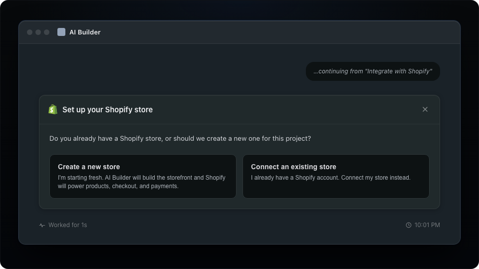
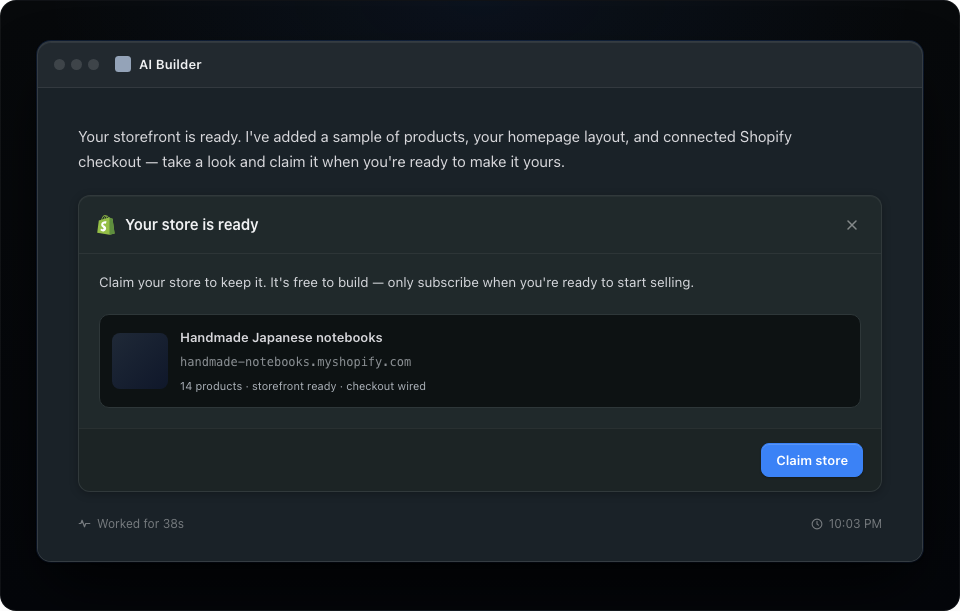

# Create a new store and claim

After the merchant selects **Integrate**, ask whether they need a new store or want to connect an existing store. If they select a new store, explain the trial before you create anything.

## General guidelines

The integrate prompt explains what Shopify is and what the merchant agrees to. Next, ask the merchant to create a new store or connect an existing store. This choice determines the remaining flow.

If the merchant creates a new store, the AI Builder creates a development store for them. At this point, the AI Builder owns the development store.

### Create a new store question

After the merchant agrees to integrate Shopify, ask if they want a new store or have an existing store.

### Claim store

The merchant must claim the development store to take ownership. The AI Builder transfers store ownership from its organization to the merchant's account. By claiming the store, the merchant also agrees to install the AI Builder's sales channel app.

#### Show the store before the claim action

Render the storefront, products, layout, and checkout before you show the claim action. The claim action lets merchants make a visible store theirs. It is not a blind agreement.

---

## In this guide

- [Introduction](../introduction.md)
- [Merchant Journey](../merchant_journey/overall_merchant_flow.md)
  - [Overall merchant flow](../merchant_journey/overall_merchant_flow.md)
  - [Overall content guidelines](../merchant_journey/overall_content_guidelines.md)
  - [Integrate with Shopify](../merchant_journey/integrate_with_shopify.md)
  - [Create a new store and claim](../merchant_journey/create_and_claim_store.md)
  - [Connect to an existing store](../merchant_journey/connect_existing_store.md)
  - [Partner sales channel](../merchant_journey/partner_sales_channel.md)
  - [Shopify onboarding steps](../merchant_journey/shopify_onboarding.md)
- [Technical Reference](../technical_reference/glossary.md)
  - [Glossary](../technical_reference/glossary.md)
  - [Understanding the Two-App Architecture](../technical_reference/two_app_architecture.md)
  - [Security Criteria](../technical_reference/security_criteria.md)
  - [Getting Started](../technical_reference/getting_started.md)
  - [Partner App: Managing Dev Stores](../technical_reference/partner_app.md)
  - [Your Sales Channel App: Accessing Store APIs](../technical_reference/sales_channel_app.md)
  - [Connect Existing Merchants](../technical_reference/connect_existing_merchants.md)
  - [Changelog](../technical_reference/changelog.md)
