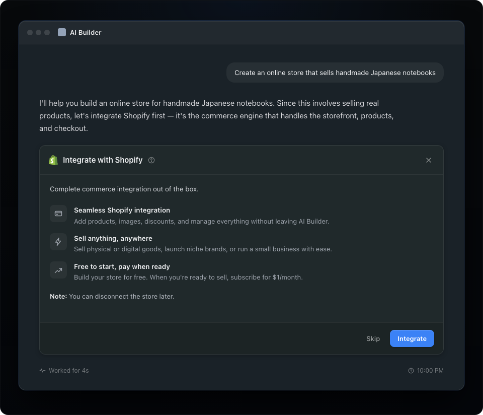

# Integrate with Shopify

When merchants express commerce intent, the AI Builder proposes a Shopify integration.

## General guidelines

The AI Builder detects commerce intent in the prompt and proposes Shopify inline. Before the click, name what Shopify is, what it powers, and what the merchant agrees to.

### Detect commerce intent

When a merchant signals that they want to sell, suggest Shopify inline. Examples include "start an online store," "sell my pottery," and "build a shop for my brand."

### Communicate what Shopify is and what the merchant agrees to

Give this information before the click. Name Shopify as the commerce engine that powers the merchant's storefront, products, and checkout. Show the value, including real checkout, free store creation, and sales across channels.

### What to include and what to skip

**Include**

- **What Shopify is.** "Shopify is the commerce engine. It powers your storefront, products, and checkout."
- **What gets created.** "A real Shopify store, with a live storefront and connected checkout, free to try."

**Skip**

- A long preamble before the offer.
- A menu of static site, store, or portfolio choices when the merchant's intent is clear.

### Match the platform's existing language

Word choice determines whether Shopify feels like a built-in capability or an external setup task. "Integrate Shopify" or "Enable Shopify" presents a one-click capability. "Connect to Shopify" or "Install Shopify" suggests an external task that interrupts the build flow.

Use the same word that the partner uses for other integrations, such as integrations, extensions, apps, or add-ons. Consistent language makes Shopify part of the platform.

## Sample prompts

Each prompt can lead a merchant to a Shopify online store. The partner should detect explicit and implicit commerce intent and propose Shopify inline.

| Prompt | Signal |
| --- | --- |
| "Build me a store selling vintage cameras" | Explicit |
| "I want to sell my pottery online" | Explicit |
| "Make me a site for my bakery" | Implicit |
| "I'm starting a skincare brand" | Implicit |
| "I make handmade leather wallets" | Implicit |

---

## In this guide

- [Introduction](../introduction.md)
- [Merchant Journey](../merchant_journey/overall_merchant_flow.md)
  - [Overall merchant flow](../merchant_journey/overall_merchant_flow.md)
  - [Overall content guidelines](../merchant_journey/overall_content_guidelines.md)
  - [Integrate with Shopify](../merchant_journey/integrate_with_shopify.md)
  - [Create a new store and claim](../merchant_journey/create_and_claim_store.md)
  - [Connect to an existing store](../merchant_journey/connect_existing_store.md)
  - [Partner sales channel](../merchant_journey/partner_sales_channel.md)
  - [Shopify onboarding steps](../merchant_journey/shopify_onboarding.md)
- [Technical Reference](../technical_reference/glossary.md)
  - [Glossary](../technical_reference/glossary.md)
  - [Understanding the Two-App Architecture](../technical_reference/two_app_architecture.md)
  - [Security Criteria](../technical_reference/security_criteria.md)
  - [Getting Started](../technical_reference/getting_started.md)
  - [Partner App: Managing Dev Stores](../technical_reference/partner_app.md)
  - [Your Sales Channel App: Accessing Store APIs](../technical_reference/sales_channel_app.md)
  - [Connect Existing Merchants](../technical_reference/connect_existing_merchants.md)
  - [Changelog](../technical_reference/changelog.md)
