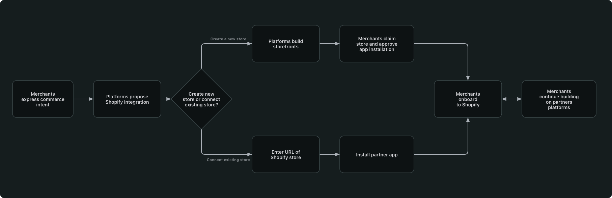

# Overall merchant flow

Four main steps take merchants from the first prompt to operating their store. At step 2, the flow divides between creating a new store and connecting an existing store.

## The flow at a glance

Merchants start by expressing commerce intent to begin their journey with Shopify. The experience diverges depending on whether they create a new store or connect an existing one. Both paths converge at admin home, where merchants can continue building on the AI Builder's platform.

---

## In this guide

- [Introduction](../introduction.md)
- [Merchant Journey](../merchant_journey/overall_merchant_flow.md)
  - [Overall merchant flow](../merchant_journey/overall_merchant_flow.md)
  - [Overall content guidelines](../merchant_journey/overall_content_guidelines.md)
  - [Integrate with Shopify](../merchant_journey/integrate_with_shopify.md)
  - [Create a new store and claim](../merchant_journey/create_and_claim_store.md)
  - [Connect to an existing store](../merchant_journey/connect_existing_store.md)
  - [Partner sales channel](../merchant_journey/partner_sales_channel.md)
  - [Shopify onboarding steps](../merchant_journey/shopify_onboarding.md)
- [Technical Reference](../technical_reference/glossary.md)
  - [Glossary](../technical_reference/glossary.md)
  - [Understanding the Two-App Architecture](../technical_reference/two_app_architecture.md)
  - [Security Criteria](../technical_reference/security_criteria.md)
  - [Getting Started](../technical_reference/getting_started.md)
  - [Partner App: Managing Dev Stores](../technical_reference/partner_app.md)
  - [Your Sales Channel App: Accessing Store APIs](../technical_reference/sales_channel_app.md)
  - [Connect Existing Merchants](../technical_reference/connect_existing_merchants.md)
  - [Changelog](../technical_reference/changelog.md)
