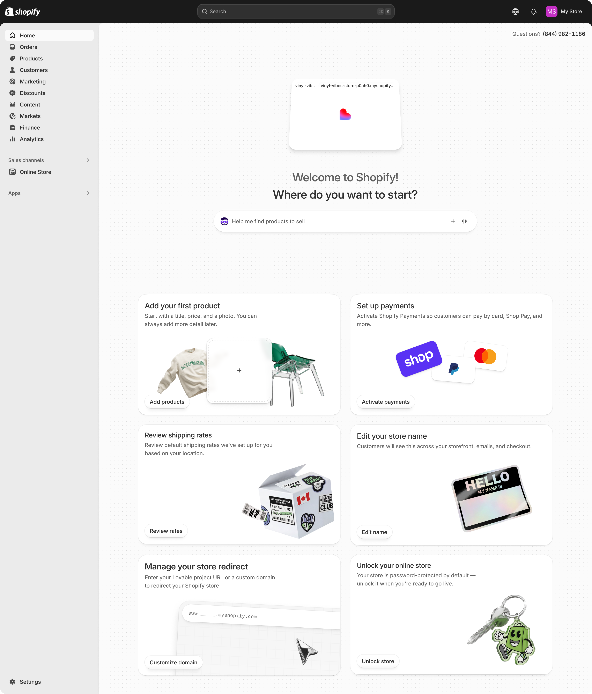

# Shopify onboarding steps

Shopify onboarding helps merchants prepare to sell.

> **Note:** Shopify actively improves onboarding for new and existing merchants who integrate through an AI Builder. This surface can change.

## First landing in admin

The merchant enters from the AI Builder and then uses Shopify admin. The AI Builder does not control the admin home. It controls the transferred storefront, products, sales channel surfaces, and the path back to the builder.

The following image shows the merchant's first Shopify admin view after the AI Builder handoff.

---

## In this guide

- [Introduction](../introduction.md)
- [Merchant Journey](../merchant_journey/overall_merchant_flow.md)
  - [Overall merchant flow](../merchant_journey/overall_merchant_flow.md)
  - [Overall content guidelines](../merchant_journey/overall_content_guidelines.md)
  - [Integrate with Shopify](../merchant_journey/integrate_with_shopify.md)
  - [Create a new store and claim](../merchant_journey/create_and_claim_store.md)
  - [Connect to an existing store](../merchant_journey/connect_existing_store.md)
  - [Partner sales channel](../merchant_journey/partner_sales_channel.md)
  - [Shopify onboarding steps](../merchant_journey/shopify_onboarding.md)
- [Technical Reference](../technical_reference/glossary.md)
  - [Glossary](../technical_reference/glossary.md)
  - [Understanding the Two-App Architecture](../technical_reference/two_app_architecture.md)
  - [Security Criteria](../technical_reference/security_criteria.md)
  - [Getting Started](../technical_reference/getting_started.md)
  - [Partner App: Managing Dev Stores](../technical_reference/partner_app.md)
  - [Your Sales Channel App: Accessing Store APIs](../technical_reference/sales_channel_app.md)
  - [Connect Existing Merchants](../technical_reference/connect_existing_merchants.md)
  - [Changelog](../technical_reference/changelog.md)
